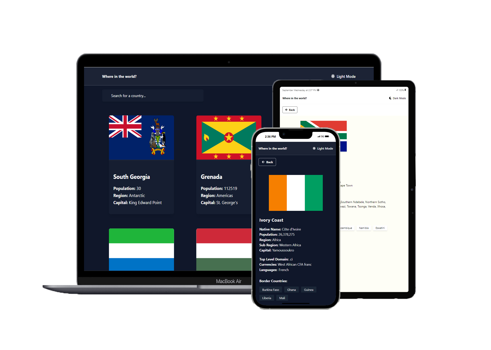

# REST Countries API with theme switcher

This is a solution to the [REST Countries API with color theme switcher challenge on Frontend Mentor](https://www.frontendmentor.io/challenges/rest-countries-api-with-color-theme-switcher-5cacc469fec04111f7b848ca).

## Built with

- [Technologies]()
  - [React](https://react.dev/)
  - [TailwindCss](https://tailwindcss.com/docs/guides/vite)
  - [React-Router-Dom](https://reactrouter.com/en/main)
- [API]()
  - [RestApi](https://restcountries.com/v3.1/all)
- [Tools]()
  - [Git/Github](https://github.com/mktmakanta)
  - [Font](https://fonts.google.com/)
  - [Fontaweseome cons](https://fontawesome.com/search)

### About the app

Users will be able to:

- See all countries from the API on the homepage
- Search for a country using an `input` field
- Filter countries by region
- Click on a country to see more detailed information on a separate page
- Click through to the border countries on the detail page
- Toggle the color scheme between light and dark mode

### Result

### Links

- Solution URL: [frontendmentor](https://www.frontendmentor.io/solutions/rest-countries-api-with-theme-switcher-JyKASSFLHT)
- Live Site URL: [Rest-countries-api](https://rest-countries-api21.vercel.app/)

### What I learned

During this project, i consume and understand how most of the react hooks wor (e.g useParams, useContext).
Also learn on different type of Api fetch methods. Learned how to use NavLink in react-router-dom.

## Developer

- Twitter - [@ibrahimmakanta](https://www.x.com/ibrahimmakanta)
- Frontend Mentor - [@mktmakanta](https://www.frontendmentor.io/profile/mktmakanta)
- Github - [@mktmakanta](https://github.com/mktmakanta)
